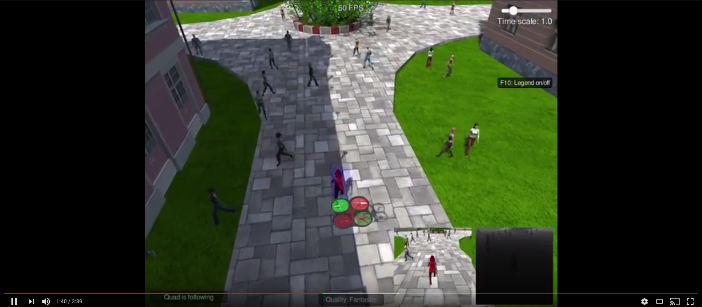
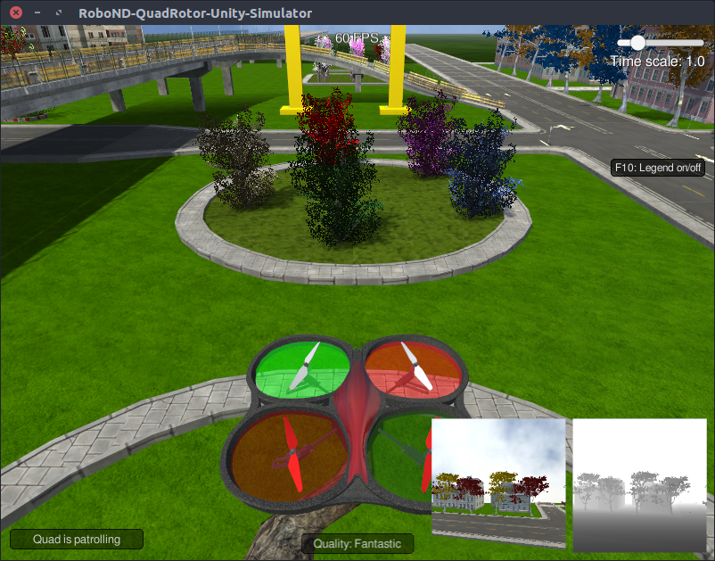

[](https://www.udacity.com/robotics)

This repository contains the project solution to Udacities RoboND semester 1 Project 4: Follow Me. The Udacity repository can be found [here](https://github.com/udacity/RoboND-DeepLearning).

The project takes image data and performs Semantic Segmentation to locate and follow a dynamic target. A video of the Semantic Segmentation model in action can be seen below.

 [](https://youtu.be/vOzxCyxd7oY)

## Writeup

The [writeup.md](writeup.md) contains details of the code and Semantic Segmentation network model used in this project.

## Simulator

You can download the Simulator which contains the follow me Project from [here](https://github.com/udacity/RoboND-DeepLearning/releases/latest).

## Install Dependencies

* Python 3.x
* Tensorflow 1.2.1
* NumPy 1.11
* SciPy 0.17.0
* eventlet
* Flask
* h5py
* PIL
* python-socketio
* scikit-image
* transforms3d
* PyQt4/Pyqt5

## Basic Build Instructions

1. Clone this repo.

  ```sh
  $ git clone https://github.com/Heych88/udacity-RoboND-DeepLearning-Project.git
  ```

## Running in the Simulator

1. Navigate to the cloned repositories location and open the `code/` folder.

 ```sh
 $ cd <path to repository>/udacity-RoboND-DeepLearning-Project/code/
 ```

2. Run the real-time follower script
 ```sh
 $ python follower.py model_weights
 ```

3. Navigate to the downloaded simulator directory and launch the simulator.
4. Select "Spawn People", and then click the "Follow Me" button.

**Note:** If you'd like to see an overlay of the detected region on each camera frame from the drone, just pass the `--pred_viz` parameter to `follower.py`.

If the above worked correctly, the Quadsim will now run autonomously along a set waypoints until the target has been located. It will then follow the target.

Upon startup, the simulator should look similar to the following.


