## Project: Follow Me

---


**Steps to complete the project:**  


1. Collect training and validation data from the simulator.
2. Implement the Encoder Block of the Semantic Segmentation network in `model_training.ipynb`.
3. Implement the Decoder Block.
4. Design the Semantic Segmentation network model.
5. Fill in the model training parameters.
6. Train the network achieving an Intersection over Union (IoU) of 0.4 or higher.


## [Rubric](https://review.udacity.com/#!/rubrics/1155/view) Points
### Here I will consider the [rubric points](https://review.udacity.com/#!/rubrics/1155/view) individually and describe how I addressed each point in my implementation.  

---
### Writeup / README

#### 1. Provide a Writeup / README that includes all the rubric points and how you addressed each one.  You can submit your writeup as markdown or pdf.  

You're reading it!

### Project Implementation

#### 1. Explain each layer of the network architecture and the role that it plays in the overall network.

The network architecture consists of three modules.
1. Encoder
2. Fully Convolutional Network (FCN)
3. Decoder

The final semantic segmentation network architecture was constructed as follows. The encoder blocks and decoder blocks are discussed below. Note that all convolutions use 'same' padding and are supported by batch normalisation.

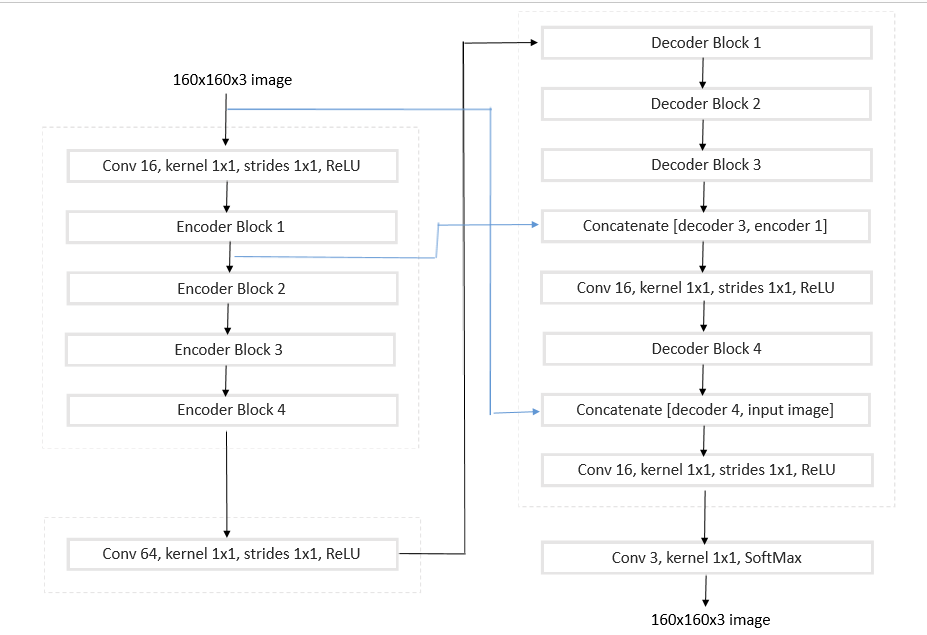

The black arrows show the data flow and the blue arrows indicate the skip connections used in the network model. Skip connections will be described later.

The code for model architecture can be found in task block seven of the `model_training.ipynb` notebook.

##### Encoder

Each *Encoder Block* is an inception model, inspired by the paper [Xception: Deep Learning with Depthwise Separable Convolutions](https://arxiv.org/abs/1610.02357). The encoder block architecture is constructed as follows. Note all convolutions, and separable convolutions use 'same' padding and are accompanied by batch normalisation.

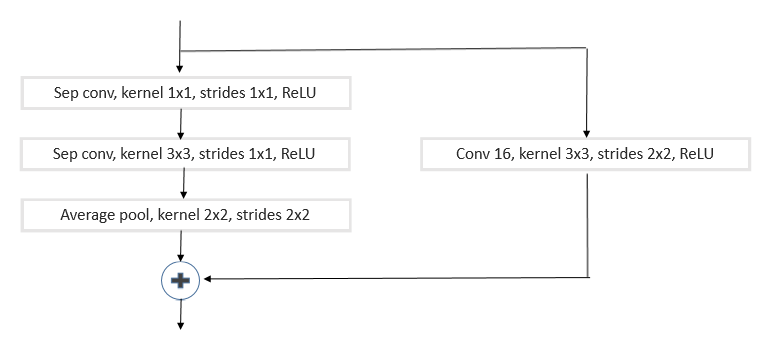

The idea behind the encoder Inception module is to make cross-channel mapping correlations and the spatial correlations process easier and more efficient by explicitly factoring it into a series of operations that would independently look at cross-channel correlations and spatial correlations.

The code for the encoder block can be found in the task block's four and five of the `model_training.ipynb` notebook.

Upon conclusion of an *encoder block*, the output tensors height and width will be half that of the input tensor. This is performed to utilise the convolutional feature extraction properties, on the input image.

##### FCN

After the *Encoder module*, the resulting convolution is passed through a *Fully Convolutional Network* (FCN). FCN's are discussed in more detail in section three, *Describe where/when/how a fully connected layer should be used.*

##### Decoder

Each *Decoder Block* architecture is shown below. Note all separable convolutions use 'same' padding and are followed by batch normalisation.

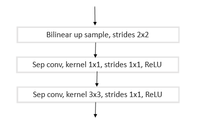

Each decoder block upsamples the input data, doubling the height and width of the data. This is followed by a cross-channel correlation of the data with a 1x1 separable convolution. These correlations are then mapped into 3D space with a 3x3 separable convolution.

The code for the decoder block can be found in the task block six of the `model_training.ipynb` notebook.

###### Skip connections

Skip connections are used to help retain spatial information of the input data. The segmentation model Implemented uses two skip connections, as shown by the blue arrows in the *semantic segmentation network architecture* diagram.

Skip connection between the early part of the encoder and the later part of the decoder was found to provide better image information retention. An accuracy increase of approximately 3% IoU was observed when the skip connection between the input image and decoder block four was changed from a skip connections between encoder block two and decoder block 2.

#### 2. Explain the neural network parameters including the values selected and how these values were obtained.

##### Model parameters

The model parameters, such as network depth, kernel's and stride sizes were derived from reading multiple research paper on *semantic segmentation*. The papers are;
 * [Xception: Deep Learning with Depthwise Separable Convolutions](https://arxiv.org/abs/1610.02357) [1]
 * [SegNet: A Deep Convolutional Encoder-Decoder Architecture for Image Segmentation](https://arxiv.org/abs/1511.00561) [2]
 * [Full-Resolution Residual Networks for Semantic Segmentation in Street Scenes](https://arxiv.org/abs/1611.08323) [3]

In the above two papers [1] [3], the only segmentation convolution kernel size used was a 3x3. As the papers have both had extensive research performed on the model, the Quadsim model would also use kernel size of 3x3.

The filter sizes were chosen using the following logic;
1. Past experience and experimentation with Convolutional neural networks.
2. The simulator's environment is less detailed than the real world, which is the testing environment for all three papers.

It has been observed that in the papers [1] and [3], the filter sizes start at 32 and increase in each layer by a factor of either four or two based on the previous filter count. However, as the simulator environment is not detail-rich, a filter size of 16 was chosen and with an increase factor of two used between layers.

##### Hyper-parameters

The training hyper-parameters, such as epochs, steps per epoch, batch size and learning rate was first intuitively sampled with quick training runs.

During testing, it was found that a learning rate of 0.01 or above, provided fast convergence but did not converge past 0.04. This resulted in utilising the Keras Adam optimisers decay rate to decrease the learning rate every batch update. A small decay rate of 0.02% was found to provide a stable decay rate with the model.  

Due to the model parameter size, a batch size of 128 utilised greater system resources than the 8Gb GPU in the training computer provided. This results in a smaller batch size which requires more training iterations for the equivalent model accuracy of larger batch sizes.

There are two methods to model training time and thus the accuracy;
1. Increase epochs count
2. Increase steps per epoch

As network performance data is obtained and printed out after each epoch,
a preference for increasing the epoch over the steps per epoch was preferred as the received performance data could be monitored to verify that;
1. The model converges towards a minimum
2. The model does not overfit the training data

After sample testing hyper-parameters, values were chosen that accounted for the network limitations performance requirements and a more extensive training run was performed.

The final hyper parameters are;  
 * Learning rate : 0.0035, with a decar rate of 0.0002
 * batch size : 100
 * epocs : 10
 * steps per epoc : 200

The model hyper-parameters can be found in the task block nine of the `model_training.ipynb` notebook.

#### 3. Describe where/when/how a fully connected layer should be used.

As outlined above in the architecture, the FCN is placed between the encoder and decoder networks. An FCN is a 1x1 convolution which retains image spacial data and results in a mini neural network running over each patch of the data, as opposed to a conventional dense layer. It is used whenever a classification layer is required that is required to retain spatial information in the network.

#### 4. Identify the use of various reasons for encoding/decoding images, when it should be used, why it is useful, and any problems that may arise.

As mentioned above, encoding of images is used to extract features from the data for classification purposes. The decoder is used to upsample the transformed features into the desired network output.

During each encoding stage, spatial data is lost from the previous layer. This is good for obtaining image features, independent of the object's position in the input image, but not for locating the position of the objects.

During the upsampling of the data in each decoder stage, each new pixel value is calculated by the weighted average of-of the four nearest neighbours. This results in a diminishing sharpness of objects in the data.

Both the loss of spatial data and demonising sharpness can be reduced by using skip connections.

#### 5. Articulate whether this model and data would work well for following another object (dog, cat, car, etc.) instead of a human and if not, what changes would be required.

As of writing this, the trained model will only follow the target human. However, if data was collected of other objects, the current network architecture trained on a different data set should work just as well as the tested human model outlined below.

### Model

#### 1. The model is submitted in the correct format.

The trained model, `model_weights`, can be found in the folder `data/weights/`.

To run the model in the simulator, navigate to the repositories location and into the folder `code/` and run the `follow.py` file with the weights file as the argument.

```sh
$ cd <path to repository>/udacity-RoboND-DeepLearning-Project/code/
$ python3 follower.py model_weights
```

#### 2. The neural network obtains an accuracy greater than or equal to 40% (0.40) using the Intersection over Union (IoU) metric.

The total IoU accuracy of the network was calculated under three different scenarios.

1. While following the target.
2. While on patrol without the target.
3. While on patrol with the target.

###### 1.  While following the target.

Below shows the output of the evaluation images of the raw camera (left image) vs the ground truth mask (centre image) vs the output of the semantic segmentation network (right image).

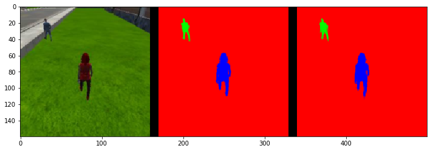
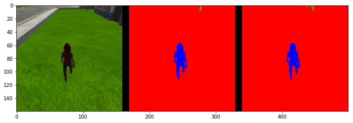
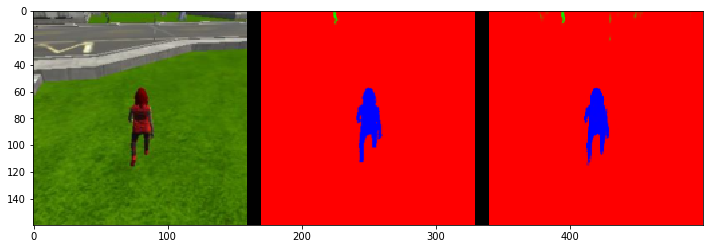

The evaluation score of the above test set;

 * number of validation samples IoU evaulated on **542**
 * average IoU for background is **0.995842239852712**
 * average IoU for other people is **0.3928061109677906**
 * average IoU for the hero is **0.8968603181040565**
 * true positives: **539**
 * false positives: **0**
 * false negatives: **0**

###### 2.  While on patrol without target.

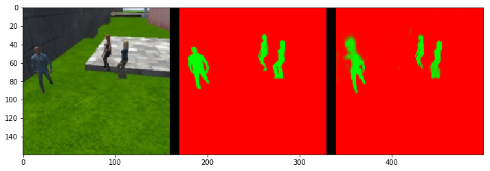
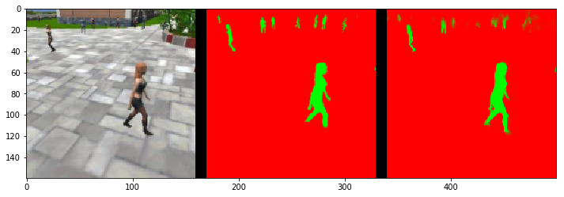
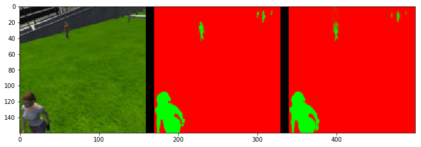

The evaluation score of the above test set;

 * number of validation samples IoU evaulated on **270**
 * average IoU for background is **0.9916744245134351**
 * average IoU for other people is **0.845031900500553**
 * average IoU for the hero is **0.0**
 * true positives: **0**
 * false positives: **9**
 * false negatives: **0**

###### 3.  While on patrol without target.

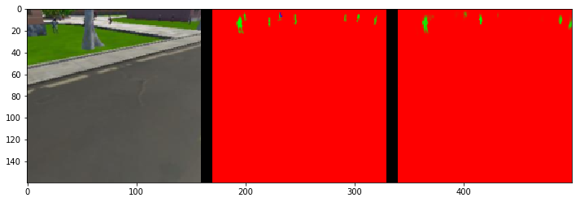
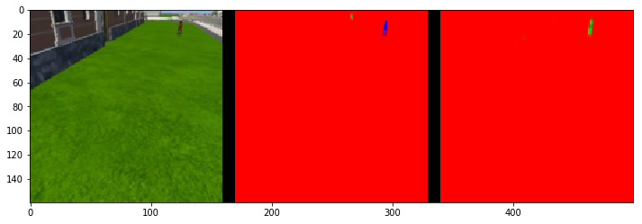
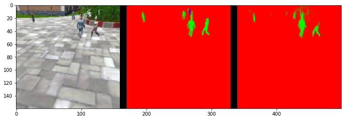

The evaluation score of the above test set;

 * number of validation samples IoU evaulated on **322**
 * average IoU for background is **0.9969243440490893**
 * average IoU for other people is **0.49343883820379797**
 * average IoU for the hero is **0.31400827476953397**
 * true positives: **145**
 * false positives: **1**
 * false negatives: **156**

###### Final results

The final resulting IoU of the network is **0.487196539721**.

The result is calculated by the average IoU of correct hero identification, excluding datasets without the hero, multiplied by the total true positives divided by the sum of the true positives, false negatives and false positives.

Further improvements to the accuracy of the current model could be achieved with the following;
* Collect more training data in varying positions and environments and train the model on the large dataset.
* Trial of separable convolutional layers instead of regular convolutional layers. Experimental results were not conclusive as to any performance increase.
* Different activation function such as elu to prevent dead RelUs.

### Future work

Should this project be improved or continued into the future, the following could be implemented.

* Deeper network model. On page five of the [Xception: Deep Learning with Depthwise Separable Convolutions](https://arxiv.org/abs/1610.02357) paper, the model used contains a middle flow that consists of eight layers of a feed forward network combined with three, 3x3 kernel separable convolutional layers.
* Image colour space conversion from RGB to HSV.
* Wider inception model in the encoder block to possibly include a 5x5 kernel with strides of 2x2 and an individual 1x1 kernel with pooling.
* Performance increase by freezing the model graph and optimising for either inference or Quantisation.
* Train the model with to locate background object for obstacle avoidance.

### Simulation

#### 1. The vehicle must successfully drive a lap around the track. No tire may leave the drivable portion of the track surface. The car may not pop up onto ledges or roll over any surfaces that would otherwise be considered unsafe (if humans were in the vehicle).

A video of a completed lap can be found on youtube [here](https://youtu.be/vOzxCyxd7oY).
